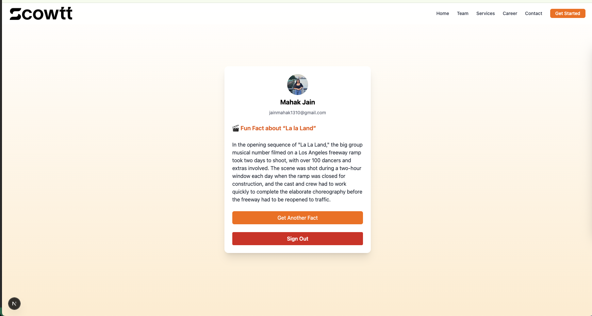

# 🎬 Movie Fun Fact App

Welcome to the Movie Fun Fact App — a full-stack web application that lets users sign in with Google, save their favorite movie, and get fun, AI-generated trivia about it. Built with a focus on clean code, security, and great user experience, this project showcases how modern technologies like Next.js, Prisma, and OpenAI can work together seamlessly.

---

## What It Does

- **Simple sign-in with Google** — no need to remember another password.
- **First-time user flow** — users are asked their favorite movie only once.
- **OpenAI-powered fun facts** — every time a user refreshes (up to 2 times), they get a new, quirky fact about their favorite movie.
- **Clean and responsive design** — built with Tailwind CSS and looks good on desktop or mobile.
- **Polished session handling** — built with NextAuth to securely manage users and sessions.

---

## 🛠️ Tech Stack

- **Frontend**: React, Next.js, TypeScript, Tailwind CSS
- **Authentication**: NextAuth with Google OAuth
- **Backend**: API Routes in Next.js
- **Database**: PostgreSQL (via Prisma)
- **AI Integration**: OpenAI GPT-3.5 (Chat API)
- **Deployment-Ready**: Vercel, Railway, or Docker-compatible

---

## Project Highlights

- Strong use of TypeScript for end-to-end type safety
- Follows Next.js best practices (file-based routing, API layer)
- Prisma ORM setup with a clean and extendable schema
- Uses `getServerSession()` to ensure protected API access
- Guards in place for invalid movie names and session refresh limits
- Mobile-friendly, responsive UI with smooth transitions

---

## 📁 Folder Structure Overview

```
components/        → Reusable UI elements (e.g., Navbar)
pages/             → All route-based pages (login, home)
pages/api/         → API routes for auth, OpenAI, DB updates
lib/               → Prisma client initialization
prisma/            → Database schema
public/            → Static files like images/logos
styles/            → Tailwind/global CSS
```

---

## Getting Started

1. **Clone the repository**
```bash
git clone https://github.com/your-username/movie-fun-facts.git
cd movie-fun-facts
```

2. **Install dependencies**
```bash
npm install
```

3. **Set up environment variables**

Create a `.env.local` file with:

```
GOOGLE_CLIENT_ID=your_google_client_id
GOOGLE_CLIENT_SECRET=your_google_client_secret
OPENAI_API_KEY=your_openai_key
NEXTAUTH_SECRET=some_random_string
NEXTAUTH_URL=http://localhost:3000
```

4. **Push Prisma schema to DB**
```bash
npx prisma db push
```

5. **Start the development server**
```bash
npm run dev
```

---

## Future Enhancements

- Add OpenAI usage logging or rate-limiting per user
- Introduce session storage or caching to persist fact history
- Create admin-only view to browse all stored users & facts
- Add error logging to better handle API or DB failures
- Add animations or a loading skeleton during fact fetch

---

## Screenshots





---

## 👋 Final Thoughts

This project was built with care and attention to detail in under 3 hours. It's meant to demonstrate real-world integration of authentication, APIs, and a clean front-end. If you’re a recruiter or reviewer, thank you for checking this out!
